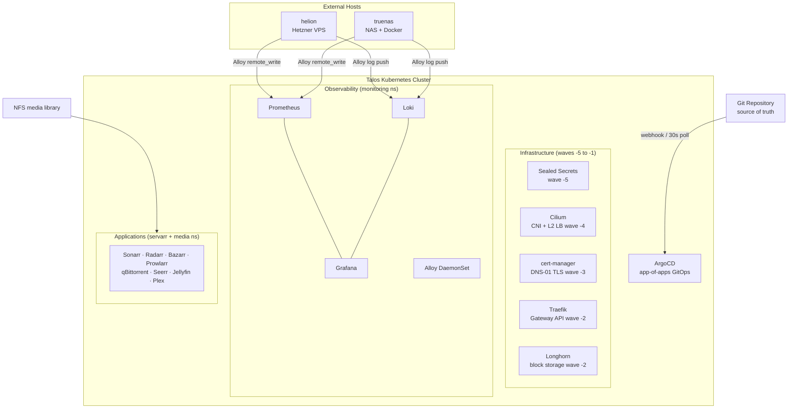

# talos-homelab

A production-grade homelab running on **Talos Linux** with fully declarative GitOps management via ArgoCD. Every cluster resource — from CNI configuration to media server deployments — is expressed as code, committed to git, and reconciled automatically. No SSH. No manual `kubectl apply` after bootstrap.

[](https://www.talos.dev)
[](https://argoproj.github.io/cd/)
[](https://cilium.io)
[](https://traefik.io)
[](https://cert-manager.io)
[](https://longhorn.io)
[](https://docs.renovatebot.com)

---

## Highlights

- **Zero-touch operations** — commit to git, ArgoCD reconciles within 30 seconds. No ad-hoc commands needed.
- **Immutable OS** — Talos Linux manages every node via API; no SSH, no shell, no package manager.
- **App-of-apps pattern** — a single root `Application` owns the entire cluster topology, including ArgoCD itself.
- **Strict sync waves** — infrastructure deploys in dependency order: secrets → CNI → TLS → ingress → apps.
- **Encrypted secrets at rest** — every `Secret` is sealed before commit; the private key never leaves the cluster.
- **Full observability** — Prometheus + Grafana + Loki + Alloy, covering in-cluster workloads and external hosts.
- **Automated dependency updates** — Renovate opens grouped PRs for all Helm charts and container images.
- **External host coverage** — Hetzner VPS and TrueNAS NAS both ship metrics and logs into the cluster stack.

---

## Architecture



---

## Stack

| Component | Version | Namespace | Role |
| --- | --- | --- | --- |
| [Talos Linux](https://www.talos.dev) | latest | — | Immutable OS, API-only node access |
| [ArgoCD](https://argoproj.github.io/cd/) | 10.0.0 | `argocd` | GitOps controller, app-of-apps |
| [Cilium](https://cilium.io) | 1.19.5 | `kube-system` | CNI, L2 LoadBalancer, kube-proxy replacement |
| [cert-manager](https://cert-manager.io) | v1.20.3 | `cert-manager` | Wildcard TLS via Cloudflare DNS-01 |
| [Traefik](https://traefik.io) | 41.0.1 | `traefik` | Gateway API controller |
| [Sealed Secrets](https://github.com/bitnami-labs/sealed-secrets) | 2.19.0 | `kube-system` | Encrypt secrets for git storage |
| [Longhorn](https://longhorn.io) | 1.12.0 | `longhorn-system` | Replicated block storage |
| [kube-prometheus-stack](https://github.com/prometheus-community/helm-charts) | 87.6.0 | `monitoring` | Prometheus + Grafana + node exporter |
| [Loki](https://grafana.com/oss/loki/) | — | `monitoring` | Log aggregation (single-binary) |
| [Grafana Alloy](https://grafana.com/oss/alloy-opentelemetry-collector/) | latest | `monitoring` | Metrics + log collector (DaemonSet + external) |
| [Metrics Server](https://github.com/kubernetes-sigs/metrics-server) | v0.8.1 | `kube-system` | `kubectl top` |
| [Renovate](https://docs.renovatebot.com) | — | — | Automated dependency PRs |

---

## Repository Layout

```text
.
├── bootstrap/
│   └── talos-cluster.yaml              ← root ArgoCD Application — applied ONCE
├── deployments/
│   ├── infrastructure/
│   │   ├── argocd/                     ← ArgoCD (self-manages after bootstrap)
│   │   ├── cert-manager/               ← Cloudflare DNS-01 issuer + wildcard cert
│   │   ├── cilium/                     ← CNI, L2 LB pool, L2 announcement policy
│   │   ├── longhorn/                   ← Distributed block storage
│   │   ├── metrics-server/
│   │   ├── observability/
│   │   │   ├── kube-prometheus-stack/  ← Prometheus, Grafana, Alloy DaemonSet
│   │   │   └── loki/
│   │   ├── sealed-secrets/
│   │   └── traefik/                    ← Gateway API controller + wildcard TLS ref
│   └── apps/
│       ├── autopulse/
│       ├── bazarr/
│       ├── byparr/
│       ├── clonarr/
│       ├── homepage/
│       ├── jellyfin/
│       ├── kubeseal-webgui/
│       ├── plex/
│       ├── prowlarr/
│       ├── qbittorrent/
│       ├── radarr/
│       ├── seerr/
│       ├── sonarr/
│       └── unpackerr/
├── helion/                             ← Alloy config for Hetzner VPS
├── truenas/                            ← Alloy config for TrueNAS
└── renovate.json
```

---

## Deployment Order

Infrastructure deploys in strict sync waves to satisfy dependencies:

| Wave | Components | Reason |
| ---: | --- | --- |
| `−5` | sealed-secrets | Must exist before any `SealedSecret` is applied |
| `−4` | cilium | CNI must be running before pods can communicate |
| `−3` | cert-manager, metrics-server | Needs networking; cert-manager begins issuing TLS |
| `−2` | traefik, longhorn | Traefik depends on the wildcard cert from cert-manager |
| `−1` | argocd | Self-manages its own CRDs and configuration |
| `0` | all apps | Runs after all infrastructure is healthy |

---

## Networking

### L2 LoadBalancer (Cilium)

Cilium handles `LoadBalancer` services via L2 announcements — no BGP, no MetalLB required. Services get IPs from a pool on the local network, announced directly from the node holding the service.

```yaml
# L2 IP pool
start: 10.0.0.153
stop:  10.0.0.199
```

### Gateway API (Traefik)

All services use `HTTPRoute` resources pointing at the cluster gateway. Traefik exposes two listeners:

| Listener | Port | Protocol |
| --- | --- | --- |
| `web` | 80 | HTTP → redirects to HTTPS |
| `websecure` | 443 | HTTPS, wildcard TLS certificate |

Every service gets a hostname following the pattern:

```text
<service>.talos-cluster.local.obleey.com
```

### TLS

cert-manager issues and auto-renews a wildcard certificate via Cloudflare DNS-01 challenge. The certificate is stored as a `Secret` in the `traefik` namespace and referenced directly by the Gateway listener — no annotation-based cert injection.

---

## Observability

### LGTM Stack

The cluster runs a full Grafana observability stack in the `monitoring` namespace:

| Component | Role |
| --- | --- |
| **Prometheus** | Metrics store — 30-day retention, 20 Gi Longhorn PVC |
| **Grafana** | Dashboards, unified alerting with Slack delivery, Google SSO |
| **Loki** | Log aggregation — single-binary, receives from all Alloy agents |
| **Alloy (DaemonSet)** | Collects node metrics, pod logs, and cAdvisor stats in-cluster |

Grafana dashboards are provisioned via ConfigMap (k8s-sidecar injection) and cover:

- **Home** — cluster-wide health overview (default home dashboard)
- **Traefik** — request rates, HTTP codes, latency distributions, per-service SLOs
- **Kubernetes** — node resources, pod lifecycle, workload health
- **Loki** — log volume and error rates by namespace
- **Containers** — Docker stats for external hosts (helion, truenas)
- **Infra Alerts** — custom rules for node memory, disk, and container health

Alertmanager is disabled. All alerting rules are evaluated by Grafana unified alerting with notifications sent to Slack.

### External Host Monitoring

Both external hosts run Grafana Alloy as a Docker container. Alloy ships node exporter metrics, Docker container metrics, and container logs into the in-cluster Prometheus and Loki instances.

| Host | Description | Sends to |
| --- | --- | --- |
| `helion` | Hetzner VPS — public-facing services | Prometheus `remote_write`, Loki push |
| `truenas` | TrueNAS NAS — media storage, Docker apps | Prometheus `remote_write`, Loki push |

Configuration for each host lives in [`helion/`](helion/) and [`truenas/`](truenas/) at the repository root.

---

## Applications

All apps use the [bjw-s/app-template](https://github.com/bjw-s-labs/helm-charts) Helm chart (v5.0.1) via ArgoCD multi-source Applications. Stateful apps reference existing PVCs (`existingClaim`) so data survives redeployments independently of ArgoCD sync.

| App | Namespace | Description |
| --- | --- | --- |
| [Sonarr](https://sonarr.tv) | servarr | TV show library manager |
| [Radarr](https://radarr.video) | servarr | Movie library manager |
| [Bazarr](https://www.bazarr.media) | servarr | Subtitle manager |
| [Prowlarr](https://prowlarr.com) | servarr | Unified indexer manager |
| [qBittorrent](https://www.qbittorrent.org) | servarr | Torrent client |
| [Seerr](https://github.com/Fallenbagel/jellyseerr) | servarr | Media request and discovery UI |
| [Clonarr](https://github.com/prophetse7en/clonarr) | servarr | TRaSH Guides profile syncer |
| [Autopulse](https://github.com/dan-online/autopulse) | servarr | Triggers targeted Plex/Jellyfin scans on import |
| [Byparr](https://github.com/thephaseless/byparr) | servarr | FlareSolverr drop-in replacement |
| [Unpackerr](https://github.com/davidnewhall/unpackerr) | servarr | Auto-extracts completed downloads |
| [Jellyfin](https://jellyfin.org) | media | Open-source media server |
| [Plex](https://www.plex.tv) | media | Plex Media Server |
| [Homepage](https://gethomepage.dev) | homepage | Cluster service dashboard |
| [kubeseal-webgui](https://github.com/Mahsad/kubeseal-webgui) | kubeseal-webgui | Web UI to seal new secrets |

### Media Pipeline

```text
Seerr (requests)
  └──► Sonarr / Radarr ──► qBittorrent ──► Unpackerr (extract)
             │                                    │
             └──► Prowlarr (indexers)      Autopulse ──► Plex / Jellyfin
             └──► Bazarr (subtitles)              (targeted library scan)
```

All servarr and media pods share a single NFS media library mount (`/mnt/media`). Config and state for each app live on individual Longhorn PVCs.

---

## Secrets Management

All secrets are encrypted with [Sealed Secrets](https://github.com/bitnami-labs/sealed-secrets) and committed to git. The controller's private key never leaves the cluster — if the key is lost, secrets must be resealed.

```text
kubectl create secret ... --dry-run=client -o yaml
    │
    └──► kubeseal  ──►  SealedSecret  (safe to commit)
                              │
              sealed-secrets controller decrypts in-cluster
                              │
                        Secret (available to pods)
```

**Sealing a new secret:**

```bash
kubectl create secret generic my-secret \
  --from-literal=key=value \
  -n my-namespace \
  --dry-run=client -o yaml \
  | kubeseal --format yaml > deployments/apps/my-app/my-secret-sealed.yaml
```

---

## Automated Updates

[Renovate](https://docs.renovatebot.com) watches all dependencies and opens grouped PRs automatically. All updates must be at least 3 days old before Renovate proposes them. Major version bumps are labelled `major-update` and are never auto-merged.

| Group | Tracks |
| --- | --- |
| Helm charts | ArgoCD, Traefik, Longhorn, cert-manager, kube-prometheus-stack, … |
| Media stack | `linuxserver/sonarr`, `linuxserver/radarr`, `linuxserver/bazarr`, … |
| GHCR images | Seerr, Clonarr, Autopulse, Byparr, kubeseal-webgui |
| Docker Hub images | Unpackerr and other Docker Hub images |

---

## Adding a New App

```text
deployments/apps/my-app/
├── app.yaml               ← ArgoCD Application (multi-source)
├── my-app-values.yaml     ← app-template Helm values
├── httproute.yaml         ← HTTPRoute for Gateway API
└── pvc.yaml               ← Longhorn PVC (if stateful)
```

Then add `- path: deployments/apps/my-app` to `deployments/apps/kustomization.yaml` and push. ArgoCD picks it up within 30 seconds.

### app.yaml template

```yaml
apiVersion: argoproj.io/v1alpha1
kind: Application
metadata:
  name: my-app
  namespace: argocd
  labels:
    argocd.argoproj.io/managed-by: talos-cluster
  finalizers:
    - resources-finalizer.argocd.argoproj.io
spec:
  project: default
  sources:
    - repoURL: https://bjw-s-labs.github.io/helm-charts
      chart: app-template
      targetRevision: 5.0.1
      helm:
        valueFiles:
          - $values/deployments/apps/my-app/my-app-values.yaml
    - repoURL: https://github.com/YOUR_USER/talos-homelab
      targetRevision: HEAD
      ref: values
      path: deployments/apps/my-app
      directory:
        exclude: "{app.yaml,my-app-values.yaml}"
  destination:
    server: https://kubernetes.default.svc
    namespace: servarr
  syncPolicy:
    automated:
      prune: true
      selfHeal: true
```

---

## Bootstrap

> One-time process. After this, ArgoCD manages everything from git.

### Prerequisites

- Talos cluster up with `kubeconfig` configured
- `helm` ≥ 3.x and `kubeseal` CLI installed
- Cloudflare account with DNS API access
- A git repository ArgoCD can reach

### Steps

#### 1. Seal your credentials

```bash
# Cloudflare API token (cert-manager DNS-01)
kubectl create secret generic cloudflare-api-token \
  --from-literal=api-token=<YOUR_TOKEN> \
  -n cert-manager --dry-run=client -o yaml \
  | kubeseal --format yaml \
  > deployments/infrastructure/cert-manager/cloudflare-api-token-sealed.yaml

# GitHub repository access
kubectl create secret generic git-creds \
  --from-literal=username=<GITHUB_USER> \
  --from-literal=password=<GITHUB_PAT> \
  -n argocd --dry-run=client -o yaml \
  | kubeseal --format yaml \
  > deployments/infrastructure/argocd/git-creds-sealed.yaml

# Slack bot token (ArgoCD notifications — optional)
kubectl create secret generic argocd-notifications-secret \
  --from-literal=slack-token=<SLACK_TOKEN> \
  -n argocd --dry-run=client -o yaml \
  | kubeseal --format yaml \
  > deployments/infrastructure/argocd/argocd-notifications-secret-sealed.yaml
```

#### 2. Install ArgoCD

```bash
helm repo add argo https://argoproj.github.io/argo-helm
helm repo update
kubectl create namespace argocd
helm install argocd argo/argo-cd \
  -n argocd \
  -f deployments/infrastructure/argocd/argocd-values.yaml
```

#### 3. Apply bootstrap secrets

```bash
kubectl apply -f deployments/infrastructure/argocd/git-creds-sealed.yaml
```

#### 4. Apply the root app — the last manual step

```bash
kubectl apply -f bootstrap/talos-cluster.yaml
```

ArgoCD reconciles the full cluster from git automatically. Sync waves ensure correct deployment order.

---

## Adapting to Your Cluster

Update these before deploying on your own hardware:

| File | What to change |
| --- | --- |
| `cilium/loadbalancer-pool.yaml` | L2 IP range for LoadBalancer services |
| `cilium/l2-announcement-policy.yaml` | Network interface name (`ip link`) |
| `cilium/cilium-values.yaml` | `k8sServiceHost` and `k8sServicePort` |
| `cert-manager/cert-manager-cluster-issuer.yaml` | Domain and Let's Encrypt email |
| `traefik/wildcard-cert.yaml` | Domain names |
| `argocd/argocd-values.yaml` and `argocd-cm.yaml` | ArgoCD external URL |
| All `HTTPRoute` manifests | Hostnames |
| All `*-values.yaml` with NFS paths | NFS server IP |
| `bootstrap/talos-cluster.yaml` and all `app.yaml` | Your git repository URL |
| All sealed secrets | Re-seal with your cluster's public key |

---

## Operations Reference

```bash
# App sync status
kubectl get applications -n argocd

# Resource usage
kubectl top nodes && kubectl top pods -A

# Force-refresh an app (bypass cache)
argocd app get <app-name> --hard-refresh

# Reload Grafana dashboard provisioning
kubectl exec -n monitoring deploy/kps-grafana -c grafana -- \
  wget -qO- --post-data='' \
  http://localhost:3000/api/admin/provisioning/dashboards/reload

# Seal a new secret
kubectl create secret generic my-secret \
  --from-literal=key=value \
  -n my-namespace --dry-run=client -o yaml \
  | kubeseal --format yaml > path/to/sealed.yaml

# Test an ArgoCD Slack notification
argocd admin notifications template notify app-sync-failed <app-name> \
  --recipient slack:#deployments -n argocd

# Rebuild cluster from scratch (after hardware reset)
helm install argocd argo/argo-cd -n argocd \
  -f deployments/infrastructure/argocd/argocd-values.yaml
kubectl apply -f deployments/infrastructure/argocd/git-creds-sealed.yaml
kubectl apply -f bootstrap/talos-cluster.yaml
# ArgoCD restores full cluster state from git
```

---

## License

MIT
